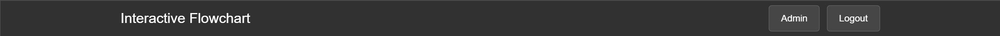
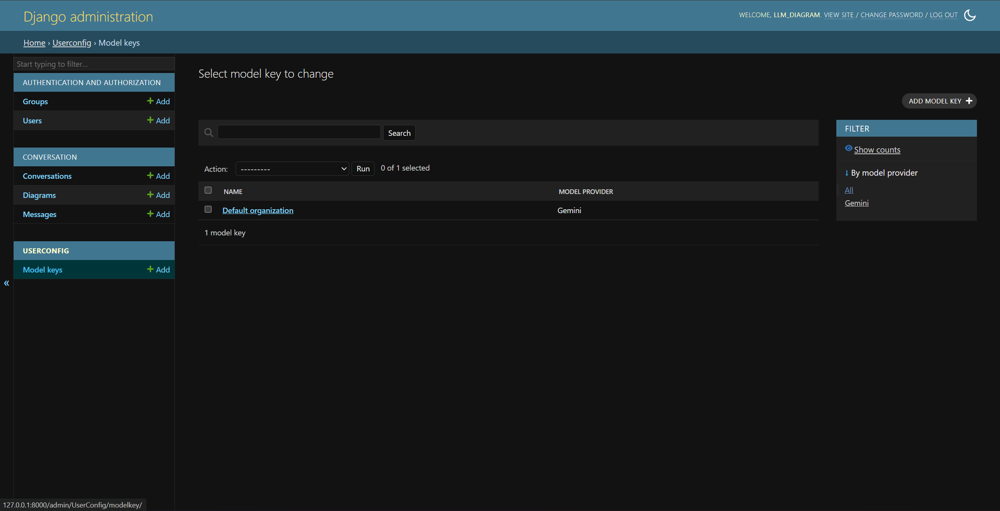
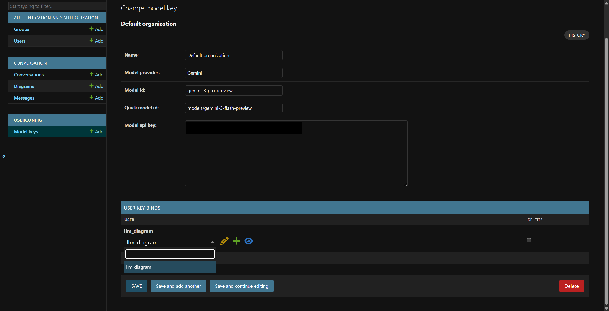
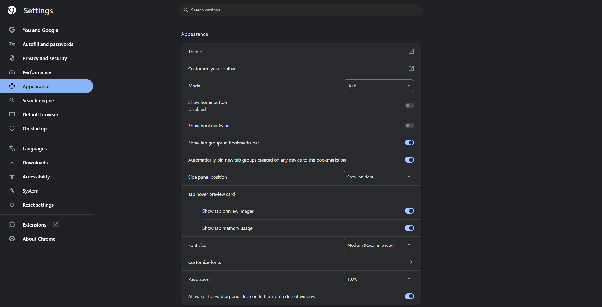
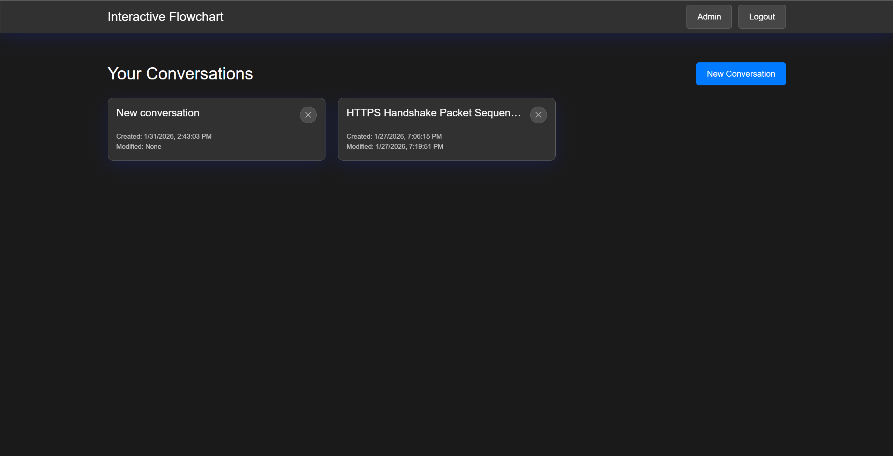
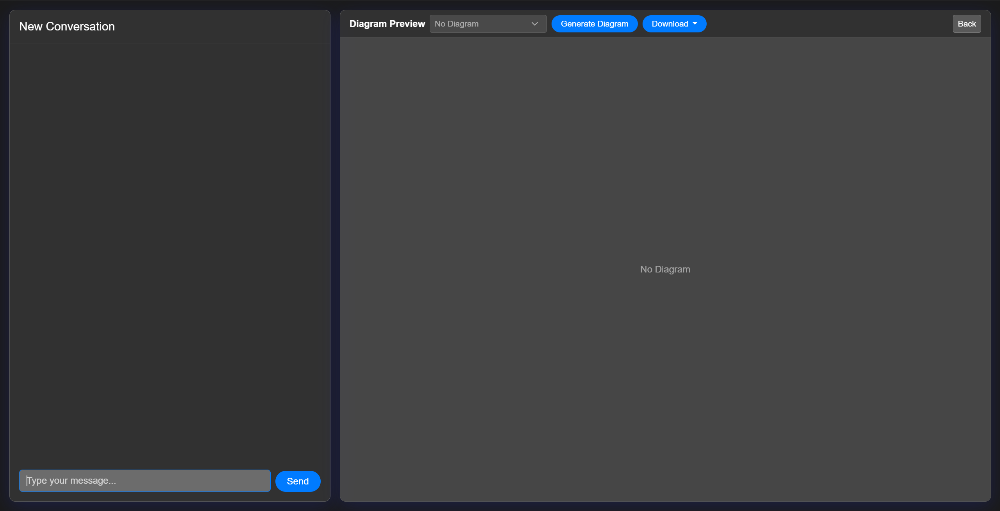
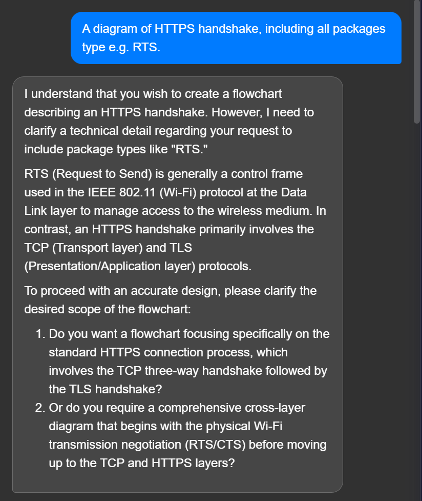
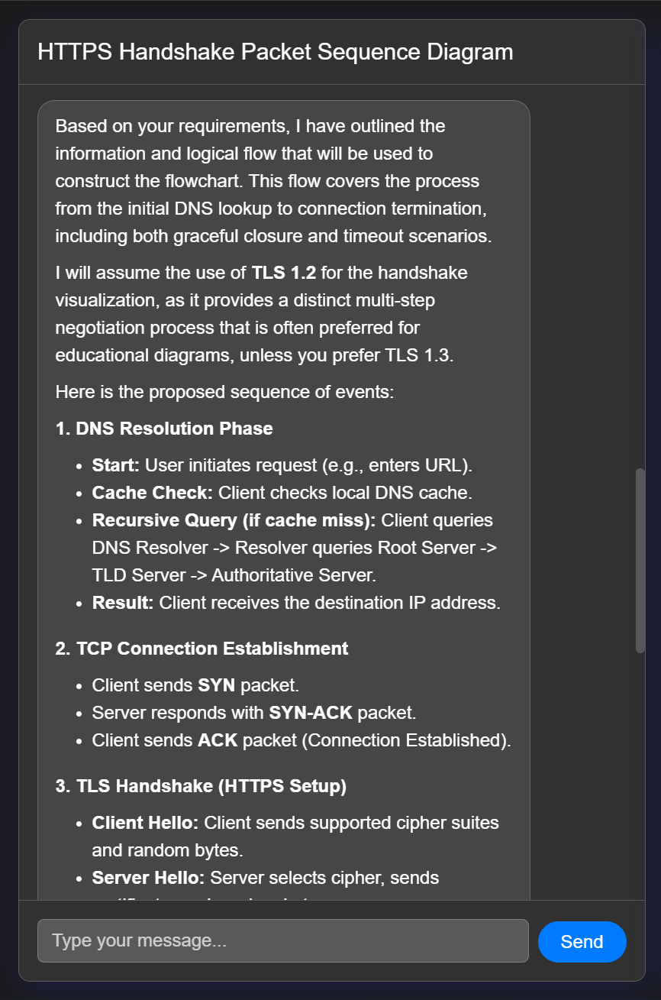
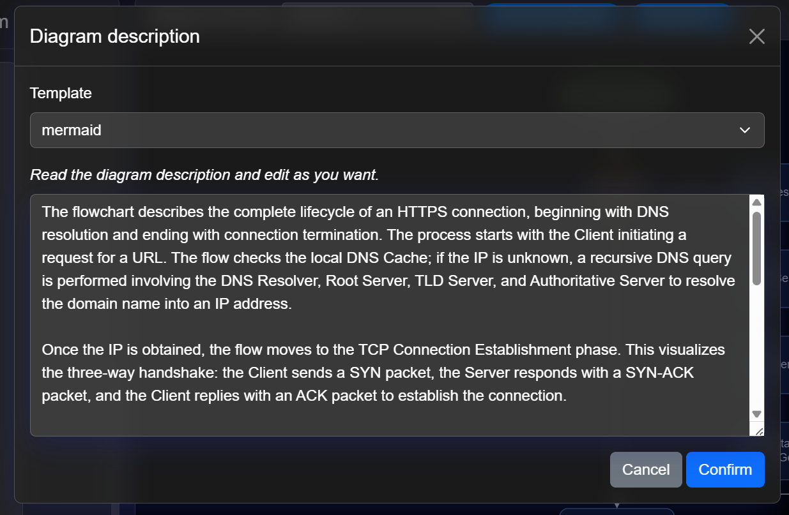
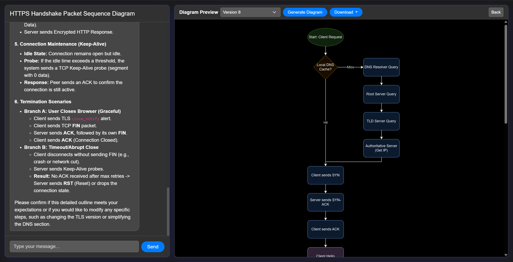

# Interactive flowchart
Discuss, describe, and generate diagrams with large language models


[TOC]


## Install

Create a text file `config.yaml` of YAML format in the program's root directory. Add the following key-value pairs into this file.

| Key                        | Value type | Description                                                  |
| -------------------------- | ---------- | ------------------------------------------------------------ |
| `secret_key`               | `str`      | Django application's secret key. Generate the key at [Djecrety](https://djecrety.ir/) website, or use any string of 50 random ASCII characters. |
| `default_model_provider`   | `str`      | Default large language model provider. <br />Options: `gemini` |
| `default_model_id`         | `str`      | Model ID of default large language model for main functions (chat, summary, draw diagrams). This model usually has strong intelligence. |
| `conv_title_model_id`      | `str`      | Model ID of the large language model to generate conversation title. This model usually is smaller and cheaper model. |
| `draw_diagram_max_retries` | `int`      | Number of times to retry when the model fails to generate a diagram, usually fails to render because of syntax error. |

Create a Python virtual environment and activate. Run the following command.

```
pip install -r requirements.txt
python manage.py migrate
python manage.py createsuperuser
```

Follow the instruction in the command line, to create a super user.


## Usage

Run the following command.

```
python manage.py runserver
```

By default, it deploys the website to https://localhost:8000 The target location can be customized; refer to [Django documentation](https://docs.djangoproject.com/en/6.0/ref/django-admin/#runserver).

The following instructions assume you deploy to the default location, unless in topic of deploying.


### Allocate large language model resources to users

Log in staff account. Click "Admin" in the main page after logged in.



In "USERCONFIG" application, "Model keys" table, create a new object.



Fill in the organization name, API key from large language model provider. You can customize the model provider and model IDs, but they should match the API key.

>   [!NOTE]
>
>   Currently, only Gemini API is integrated. You can use other providers whose API is compatible to Gemini.

Add users who will have access to this large language model to "USER KEY BINDS" table.

>   [!TIP]
>
>   Delete user here only removes there access to the large language model, but won't delete their account.



### Light & dark theme

The program determines light or dark theme according to the user's browser settings. For example, if the user uses Chrome browser, the program will show dark theme if "Settings > Appearance > Mode" is "Dark". Technically, it implements dark theme CSS in `@media (prefers-color-scheme: dark)` tag.



### Generate diagrams

After logged in, the user will see the list of conversations, which they have created and is empty at the first time logging in.



Click "New conversation" to create a new conversation. 



It takes 3 steps to generate a diagram.

1.   Describe the flowchart that you want to create, for example: "A diagram of HTTPS handshake, including all packages type e.g. RTS." Even vague, incomplete, or very initial idea works, because large language models will ask follow-up questions and you have the opportunity to clarify.
     
     
     
     When LLM feels confident that they have enough information to generate a flowchart, they'll summarize in the conversation. 
     
     
     
2.   Click "Generate Diagram" button and wait for a while, LLM will read the chat history and generate a complete and detailed description of the flowchart.
     Review the description and edit if you want.
     
     
     
3.   Click "Confirm", this program will generate a diagram and increase the version number. You're able to preview it in the page.
     
     

>   [!TIP]
>
>   You can choose a template from the dropdown in step 2.. 
>
>   If you don't know what is it, keep the default is fine.
>
>   This is the syntax to define the diagram, just like different programming languages. By using different syntax, LLM will generate different source code of diagram, and this program will use different HTML template to render (preview) it. The full list of available renderers is in [Renderers](#renderers) section.

This program supports to download the diagram in different formats. Click "Download" and choose a format.

-   HTML: Choose this if you want to use the diagram in a presentation. For some formats (such as mermaid and draw.io), it allows you to scroll down and read the full diagram if it's longer than your screen. For other formats (such as graphviz or tikz), it allows you to zoom and move the diagram to read the details or have an overview.

-   Source code: Choose this if you want to edit the diagram again. You can download and copy the source code to the corresponding renderer. The official website will provide their specific tool to have the full control of the diagram, therefore you can modify any part as you want.

-   Picture (Experimental): Choose this if you want to create a screenshot. This function mocks Google Chrome built-in "Capture full size screenshot" function.

>   [!NOTE]
>
>   This option is "Experimental" because the usage of mouse zoom & move makes it in fact more like "Capture area screenshot" for most formats. This function only works in "mermaid" renderer.

You cannot edit the generated diagram. If you're not satisfied with the results, discuss with LLM and request it to improve the description. Re-generate the diagram with even the same description will lead to different results.

### Renderers

This program supports the following renderers:

-   Markdown mermaid (default): https://mermaid.js.org/intro/
-   Cytoscape: https://cytoscape.org/
-   Graphviz: https://graphviz.org/
-   $\LaTeX$ Tikz: https://tikz.net/
-   Draw.io: https://app.diagrams.net/
-   SVG: https://www.w3.org/TR/SVG/
